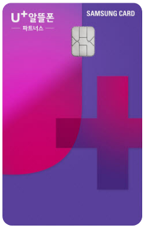

# Card Example
This page demonstrates usage of some of the card provided by Alpah Project.

## Source Sample
### 삼성카드
```source
<!DOCTYPE html>
<html>
  <head>
    <meta charset="utf-8">
    <title>event</title>
    <meta name="viewport" content="width=device-width, initial-scale=1.0, maximum-scale=1.0, minimum-scale=1.0, user-scalable=no">
    <link rel="stylesheet" href="../../assets/css/animation.css" />
    <link rel="stylesheet" href="../../assets/css/common.css" />
    <link rel="stylesheet" href="../../assets/css/content.css" />
    <link rel="stylesheet" href="../../assets/css/form.css" />
    <link rel="stylesheet" href="../../assets/css/main.css" />
    <link rel="stylesheet" href="../../assets/css/responsive.css" />
    <link rel="stylesheet" href="../../assets/css/style.css" />
    <style>
      .mobile_header {
        height: 100%;
        border: 1px solid rgba(0,0,0,0.5);
        background: #fff;
      }
    </style>
    <script>
      const front = {
        device(){
          const elem = document.querySelector("html");
          const userAgent = navigator.userAgent;

          const mobile = /Android|webOS|iPhone|iPad|iPop|BlackBerry|IEmobile|Opera Mini/i;
          const ios = /iPhone|iPad|iPop/i;
          const aos = /Android/i;

          mobile.test(userAgent) ? elem.classList.add('mobile') : elem.classList.add('pc');
          ios.test(userAgent) ? elem.classList.add('ios') : null;
          aos.test(userAgent) ? elem.classList.add('android') : null;
          
          // ie check
          const msie = /MSIE/i;
          const trident = /Trident/i;

          if( msie.test(userAgent) && trident.test(userAgent) ) {
            const ieVer = document.documentMode; // IE 브라우저 버전
            elem.classList.add('ie' + ieVer);

          } else if( !msie.test(userAgent) && trident.test(userAgent)) {
            elem.classList.add('ie11');
          }

          // etc browser check
          const edge = /Edg/i;
          const opr = /OPR/i;
          const opera = /Opera/i;
          const chrome = /Chrome/i;
          const safari = /Safari/i;
          const firefox = /Firefox/i;

          edge.test(userAgent) ? elem.classList.add('edg') : null;
          ( opr.test(userAgent) || opera.test(userAgent) ) ? elem.classList.add('opera') : null;
          chrome.test(userAgent) ?  elem.classList.add('chrome') : null;
          safari.test(userAgent) ? elem.classList.add('safari') : null;
          firefox.test(userAgent) ? elem.classList.add('firefox') : null;
        },
        /**
         * 디바이스 모바일 체크
         * @returns Boolean, html이 mobile 클래스를 가지고 있으면 true 반환
         */
        isMobile(){
          // const userAgent = navigator.userAgent;
          // const mobile = /Android|webOS|iPhone|iPad|iPop|BlackBerry|IEmobile|Opera Mini/i;

          // return mobile.test(userAgent);

          return document.querySelector("html").classList.contains("mobile");
        }
      }

      window.addEventListener('load', () => {
        front.device()
      })
    </script>
  </head>
  <body class="">
    <div id="__nuxt">
      <!--[-->
      <script src="https://js.tosspayments.com/v1/payment-widget"></script>
      <div>
        <!---->
        <div class="skip">
          <a aria-current="page" href="/benefit/affiliate-card#content" class="router-link-active router-link-exact-active">본문 바로가기</a>
        </div>
        <div class="wrap">
          <!---->
          <header class="header">
            <div class="pc_header">
              <div class="inner">
                <h1>
                  <a>
                    <span class="blind">알뜰폰닷컴</span>
                  </a>
                </h1>
                <nav class="nav">
                  <ul>
                    <li>
                      <a aria-current="page" href="/benefit/affiliate-card" class="router-link-active router-link-exact-active menu_class">
                        <span>유심구매</span>
                      </a>
                      <!---->
                    </li>
                    <li>
                      <a aria-current="page" href="/benefit/affiliate-card" class="router-link-active router-link-exact-active menu_class">
                        <span>요금제</span>
                      </a>
                      <!---->
                    </li>
                    <li>
                      <a aria-current="page" href="/benefit/affiliate-card" class="router-link-active router-link-exact-active menu_class">
                        <span>혜택</span>
                      </a>
                      <!---->
                    </li>
                    <li>
                      <a aria-current="page" href="/benefit/affiliate-card" class="router-link-active router-link-exact-active menu_class">
                        <span>고객지원</span>
                      </a>
                      <!---->
                    </li>
                  </ul>
                </nav>
                <div class="header_menu">
                  <ul>
                    <li>
                      <a href="/login" class="">로그인</a>
                    </li>
                    <li>
                      <a href="/register" class="">회원가입</a>
                    </li>
                    <!---->
                    <!---->
                    <li>
                      <a href="/mypage" class="">마이페이지</a>
                    </li>
                  </ul>
                </div>
              </div>
            </div>
            <div class="mobile_header">
              이벤트 상세
            </div>
          </header>
          <!---->
          <div class="container">
            <div class="content" id="content">
              <h2 class="title_nav">제휴카드 안내</h2>
              <div class="section asso">
                <div>
                  <!---->
                  <!---->
                  <!---->
                  <div class="tag_list tagList variable">
                    <ul>
                      <!---->
                      <li role="none" class="">
                        <button type="button" role="option" aria-selected="true">현대카드</button>
                        <!---->
                      </li>
                      <li role="none" class="">
                        <!---->
                        <button type="button" role="option" aria-selected="false">우리카드</button>
                      </li>
                      <li role="none" class="on">
                        <!---->
                        <button type="button" role="option" aria-selected="false">삼성카드</button>
                      </li>
                    </ul>
                    <!---->
                  </div>
                  <div>
                    


                  <!-- 어드민 등록 -->
                  <style>
                    .card_info_wrap .logo_area>img {
                      width: auto;
                    }
                    .card_info_wrap .img_info {
                      background: none;
                    }
                    .pc .asso .card_info_wrap .info_area .txt_info {
                      flex: auto;
                    }
                    .pc .asso .card_info_wrap .info_area .txt_info .text_list {
                      text-align: center;
                    }
                    .pc .asso .card_info_wrap .info_area .txt_info .text_list li:before {
                      content: '';
                      position: static;
                      display: inline-block;
                      margin: -0.3rem 0.6rem 0 0px;
                      vertical-align: middle;
                    }
                    .asso .card_info_wrap .info_area .card-list {
                      margin-top: 2rem;
                    }
                    .pc .asso .card_info_wrap .info_area .card-list {
                      display: flex;
                      align-items: flex-start;
                      justify-content: space-between;
                      flex-wrap: wrap-reverse;
                    }
                    .graph .bar_inner {
                      transform-origin: bottom;
                      transform: scaleY(0);
                      transition: transform 0.5s;
                    }
                    .graph.active .bar_inner {
                      transform: scaleY(1);
                    }
                    .v-expansion-panels {
                      display: flex;
                      flex-wrap: wrap;
                      justify-content: center;
                      list-style-type: none;
                      padding: 0;
                      width: 100%;
                      position: relative;
                      z-index: 1;
                    }
                    .asso .v-expansion-panels {
                      margin-top: 2.4rem;
                    }
                    .pc .asso .v-expansion-panels {
                      margin-top: 4.8rem;
                    }
                    .dlvr_step_info {
                      margin-top: 2.7rem;
                    }
                    .dlvr_step_info > dl {
                      display: flex;
                      margin: 0;
                      padding: 1.2rem 0.8rem;
                      border-bottom: 1px dashed #ddd;
                      line-height: 2rem;                  
                      align-items: center;
                    }
                    .dlvr_step_info dt {
                      width: 8rem;
                      padding-right: 0.5rem;
                      color: #4369ee;
                      font-size: 1.3rem;
                      font-family: 'Jalnan';
                      flex: none;
                      line-height: 1.5;
                    }
                    .pc .dlvr_step_info dt {
                      font-size: 1.6rem;
                      width: 12rem;
                    }
                    .dlvr_step_info dd {
                      font-size: 1.3rem;
                      line-height: 1.5;
                      word-break: keep-all;
                    }
                    .pc .dlvr_step_info dd {
                      font-size: 1.6rem;
                    }
                    .v-expansion-panel {
                      flex: 1 0 100%;
                      max-width: 100%;
                      position: relative;
                      transition: 0.3s all cubic-bezier(0.4, 0, 0.2, 1);
                      transition-property: margin-top, border-radius, border, max-width;
                      border-radius: 4px;
                      background: #f8f8f8;
                      overflow: hidden;
                      padding: 0;
                    }
                    .pc .v-expansion-panel {
                      padding: 1rem 2rem;
                    }
                    .v-expansion-panel-title {
                      align-items: center;
                      text-align: start;
                      border-radius: inherit;
                      display: flex;
                      font-size: 1.5rem;
                      line-height: 2.2rem;
                      min-height: 48px;
                      font-weight: 700;
                      position: relative;
                      transition: 0.3s min-height cubic-bezier(0.4, 0, 0.2, 1);
                      width: 100%;
                      justify-content: space-between;
                      padding: 0;
                    }
                    .pc .v-expansion-panel-title {
                      font-size: 1.8rem;
                    }
                    .v-expansion-panel-title > button {
                      display: flex;
                      justify-content: space-between;
                      width: 100%;
                      text-align: left;
                      padding: 2rem;
                    }
                    .v-expansion-panel-title > button::after {
                      content: '';
                      display: block;
                      width: 2.4rem;
                      height: 2.4rem;
                      transform: rotate(180deg);
                      background: url('../../public/images/temp/제휴카드[삼성]on/ico_samsungcard_join_arrow.png') -5rem 0 / 20rem auto no-repeat;
                    }
                    .v-expansion-panel-title.toggle > button::after {
                      transform: rotate(0);
                    }
                    .v-expansion-panel-text {
                      display: flex;
                      padding: 0 2rem 2rem;
                      flex: 1 1 auto;
                      max-width: 100%;
                    }
                    .text_info::before {
                      content: '';
                      position: absolute;
                      top: 0.3rem;
                      left: 0;
                      display: block;
                      width: 1.2rem;
                      height: 1.2rem;
                      background: url('../../public/images/temp/제휴카드[삼성]on/logo_samsungcard_sprite.png') -14rem 0 / 20rem auto no-repeat;
                    }
                  </style>
                  <h3 class="blind">삼성카드</h3>
                  <div class="panel_cnt">
                    <!-- tab panel로 위치 이동 ; 23/11/23 -->
                    <div class="card_info_wrap">
                      <div class="logo_area">
                        
                      </div>
                      <div class="tit_area">
                        <div class="tit"> U<sup>+</sup> 알뜰폰 삼성카드 </div>
                        <strong class="asso_point fc01">매월 최대 2만원/ 2만1천원/ 2만2천원 할인</strong>
                      </div>
                      <div class="img_area">
                        
                      </div>
                      <div class="info_area">
                        <div class="txt_info">
                          <!-- <strong>이용실적</strong> -->
                          <ul class="text_list bull">
                            <li>전월 카드 이용 실적이 30만/70만/120만 이상일 경우</li>
                            <li>U<sup>+</sup>알뜰 통신요금 정기결제 시</li>
                            <li>직전 6개월 동안 삼성개인신용카드 결제 이력이 없는 회원</li>
                            <li>자세한 내용은 카드 혜택 페이지에서 확인</li>
                          </ul>
                        </div>
                        <ul class="card-list">
                          <li>
                            <div class="img_info"></div>
                            <div class="txt_info">
                              <strong>최대 <span class="fc01">20,000</span>원 할인</strong>
                              <p>전월 이용금액이 30만원 이상인 경우</p>
                            </div>
                          </li>
                          <li>
                            <div class="img_info"></div>
                            <div class="txt_info">
                              <strong>최대 <span class="fc01">21,000</span>원 할인</strong>
                              <p>전월 이용금액이 70만원 이상인 경우</p>
                            </div>
                          </li>
                          <li>
                            <div class="img_info"></div>
                            <div class="txt_info">
                              <strong>최대 <span class="fc01">22,000</span>원 할인</strong>
                              <p>전월 이용금액이 120만원 이상인 경우</p>
                            </div>
                          </li>
                        </ul>
                      </div>
                    </div>
                    <!-- <div class="box_gray">
                      <ul class="text_list bull">
                        <li>자세한 내용은 카드 혜택 페이지에서 확인해주세요.</li>
                      </ul>
                    </div> -->
                    <div class="btn_group">
                      <a href="https://www.samsungcard.com/home/card/cardinfo/PGHPPCCCardCardinfoDetails001?code=AAP1733" target="_blank" class="btn md c03">카드 혜택 자세히 보기</a>
                    </div>
                    <!-- //카드 정보 -->
                    <div class="tit_wrap">
                      <strong class="tit_sub">삼성카드 직전 6개월 무실적회원이 <br class="pc_hide" />U<sup>+</sup> 알뜰폰 통신요금 정기 결제 시</strong>
                      <h3 class="tit03">전월 이용금액대별 추가 결제일 <br class="pc_hide" />할인 혜택 제공</h3>
                      <div class="bag card">카드당 1회</div>
                    </div>
                    <div class="asso_bar_wrap">
                      <strong class="asso_bar_tit">전월 카드 이용금액 기준</strong>
                      <!-- graph -->
                      <div class="asso_bar graph">
                        <ul class="bar_cmpri">
                          <li>
                            <div class="bar_area">
                              <div class="bar_inner" style="height: 20%;">
                                <strong class="max">최대 <br>20,000원 </strong>
                              </div>
                            </div>
                            <span class="price">프로모션 혜택<br />11,000원 포함<br />30만원 이상</span>
                          </li>
                          <li>
                            <div class="bar_area">
                              <div class="bar_inner" style="height: 50%;">
                                <strong class="max">최대 <br>21,000원 </strong>
                              </div>
                            </div>
                            <span class="price">프로모션 혜택<br />9,000원 포함<br />70만원 이상</span>
                          </li>
                          <li>
                            <div class="bar_area">
                              <div class="bar_inner" style="height: 100%;">
                                <strong class="max">최대 <br>22,000원 </strong>
                              </div>
                            </div>
                            <span class="price">프로모션 혜택<br />7,000원 포함<br />120만원 이상</span>
                          </li>
                        </ul>
                      </div>
                      <!-- //graph -->
                    </div>
                    <!-- //알뜰폰 통신요금 정기 결제 -->

                    <!-- 프로모션 안내 -->
                    <div class="tit_wrap">
                      <h3 class="tit03">프로모션 안내</h3>
                    </div>
                    <div class="dlvr_step_info">
                      <dl>
                        <dt>
                          <strong>행사기간</strong>
                        </dt>
                        <dd>
                          <ul>
                            <li>2024.3.1(금)~2024.3.31(일)</li>
                          </ul>
                        </dd>
                      </dl>
                      <dl>
                        <dt>
                          <strong>대상회원</strong>
                        </dt>
                        <dd>
                          <ul>
                            <li>행사기간 직전 6개월 동안(2023.9.1~2024.2.29) 삼성개인신용카드 결제 이력이 없는 회원</li>
                            <li>행사기간 전에 대상 카드로 U+알뜰 통신요금 정기결제 이력이 없는 회원</li>
                          </ul>
                        </dd>
                      </dl>
                      <dl>
                        <dt>
                          <strong>행사내용</strong>
                        </dt>
                        <dd>
                          <ul>
                            <li>U<sup>+</sup>알뜰폰 파트너스 삼성카드로 24.4월까지 U+알뜰 통신요금 정기결제 납부 시, 24개월동안 전월 이용금액대별 추가 결제일할인 제공</li>
                          </ul>
                        </dd>
                      </dl>
                    </div>
                    <!-- // 프로모션 안내 -->

                    <!-- 할인기준 -->
                    <div class="tit_wrap">
                      <h3 class="tit03">할인기준</h3>
                    </div>
                    <div class="table">
                      <table>
                        <caption>통신요금정보</caption>
                        <colgroup>
                          <col style="width:25%">
                          <col style="width:25%">
                          <col style="width:25%">
                          <col style="width:25%">
                        </colgroup>
                        <thead>
                          <tr>
                            <th scope="colgroup" colspan="4">
                              <strong>월 할인한도</strong>
                            </th>
                          </tr>
                          <tr>
                            <th scope="col">전월 이용 금액</th>
                            <th scope="col">카드 할인</th>
                            <th scope="col">프로모션 할인</th>
                            <th scope="col">총 할인한도</th>
                          </tr>
                        </thead>
                        <tbody>
                          <tr>
                            <td>30만원 이상 ~ 70만원 미만</td>
                            <td><strong>7,000원 ~ 10,000원</strong></td>
                            <td><strong><em class="fc01">10,000</em>원</strong></td>
                            <td><strong>17,000원 ~ 20,000원</strong></td>
                          </tr>
                          <tr>
                            <td>70만원 이상 ~ 120만원 미만</td>
                            <td><strong>10,000원 ~ 13,000원</strong></td>
                            <td><strong><em class="fc01">8,000</em>원</strong></td>
                            <td><strong>18,000원 ~ 21,000원</strong></td>
                          </tr>
                          <tr>
                            <td>120만원 이상</td>
                            <td><strong>13,000원 ~ 16,000원</strong></td>
                            <td><strong><em class="fc01">6,000</em>원</strong></td>
                            <td><strong>19,000원 ~ 22,000원</strong></td>
                          </tr>
                        </tbody>
                      </table>
                    </div>
                    <div class="box_gray">
                      <ul class="text_list bull">
                        <li>24.4월 매출부터 추가 결제일할인이 제공되며, 24.3월에 발생한 매출에는 추가 결제일할인이 제공되지 않음</li>
                        <li>카드 할인은 전월 생활요금 정기결제 건수(0건~3건이상)에 따라 금액이 달라짐.                          </li>
                        <li>생활요금 정기결제 건수는 전월 1일부터 말일까지 매출전표가 접수된 정기결제건 중 10,000원 이상 결제된 건을 기준으로 산정</li>
                        <li>생활요금 정기결제 업종 : 아파트 관리비, 4대 사회보험, 생명보험, 손해보험, 렌탈(코웨이, SK매직)</li>
                        <li>예시: 24.11월에 75만원을 이용하고 보험 및 렌탈 총 4건 정기결제 시 24.12월 통신요금 22,000원 할인</li>
                        <li>카드할인 혜택관련 이용조건 및 적립한도 위 ‘카드 혜택 자세히보기를’ 통해 확인</li>
                      </ul>
                    </div>
                    <!-- // 할인기준 -->

                    <!-- 연회비 -->
                    <div class="tit_wrap">
                      <h3 class="tit03">연회비</h3>
                    </div>
                    <div class="list_info_ty01 w50">
                      <dl>
                        <dt>국내전용</dt>
                        <dd class="ann_fee"><strong>20,000원</strong></dd>
                      </dl>
                      <dl>
                        <dt>해외 겸용(VISA)</dt>
                        <dd class="ann_fee"><strong>20,000원</strong></dd>
                      </dl>
                    </div>
                    <div class="text_info">후불교통기능이 탑재되어 발급</div>
                    <!-- //연회비 -->

                    <!-- 제휴카드 이용 -->
                    <div class="tit_wrap">
                      <h3 class="tit03">제휴카드 이용 및 등록 안내</h3>
                    </div>
                    <div class="list_box_gray">
                      <ul>
                        <li>
                          <div class="box_gray">
                            <div class="list_box_num">
                              <b></b>
                              <span>꼭! ‘U+ 알뜰 모바일‘ 전용 제휴카드로 이용</span>
                            </div>
                            <a href="https://www.samsungcard.com/home/card/cardinfo/PGHPPCCCardCardinfoDetails001?code=AAP1733" target="_blank" class="btn xsm c07">자세히 보기</a>
                          </div>
                        </li>
                        <li>
                          <div class="box_gray">
                            <div class="list_box_num">
                              <b></b>
                              <span>통신료 자동이체 수단 변경 필수</span>
                            </div>
                          </div>
                        </li>
                        <li>
                          <div class="box_gray">
                            <div class="list_box_num">
                              <b></b>
                              <span>제휴카드 전월 실 충족 시 통신료 할인</span>
                            </div>
                          </div>
                        </li>
                      </ul>
                    </div>
                    <!-- //제휴카드 이용 -->

                    <!-- 카드문의 -->
                    <div class="tit_wrap">
                      <h3 class="tit03">카드문의</h3>
                    </div>
                    <div class="list_info_ty01 w50">
                      <dl>
                        <dt>삼성카드 대표전화</dt>
                        <dd class="ann_fee"><strong><a href="tel: 1588-8700">1588-8700</a></strong></dd>
                      </dl>
                    </div>
                    <!-- //카드문의 -->

                    <!-- 유의사항 & 필수 안내 사항 toggle -->
                    <div class="acd_wrap v-expansion-panels">
                      <div class="acd_item v-expansion-panel">
                        <div class="acd_title v-expansion-panel-title">
                          <button onclick="toggleAccordion(0)">유의사항 <span class="blind">닫기</span></button>
                        </div>
                        <div class="acd_panel">
                          <div class="v-expansion-panel-text">
                            <ul class="text_list bull">
                              <li>본 혜택은 결제일할인으로 제공됩니다.</li>
                              <li>24.4월에 통신요금 정기결제 매출이 접수되지 않은 경우, 추가 결제일할인이 제공되지 않거나 금액이 변경될 수 있음</li>
                              <li>U+알뜰폰 파트너사의 LG U+ 통신요금에 한해 혜택이 제공됩니다.</li>
                              <li>U+알뜰폰 통신요금 2건 이상 정기결제 시에도 합산하여 통합 월 1회 제공됩니다.</li>
                              <li>U+알뜰폰 통신요금 정기결제 합산 금액이 월 할인금액보다 적은 경우, 통신요금 정기결제 금액만큼 해당월 회원님의 카드 결제대금에서 자동 차감됩니다.</li>
                              <li>U+알뜰폰 파트너사 및 요금제는 알닷 홈페이지(uplusmvno.com) 또는 해당 알뜰폰 파트너사 홈페이지에서 확인 가능합니다.</li>
                              <li>전월 이용금액이란, 매월 1일부터 말일까지 이용한 일시불 및 할부 이용금액에 한하며, 무이자할부, 건강보험/국민연금/고용보험/산재보험 및 장애인 고용부담금, 국세/지방세/공과금, 초 · 중 · 고등학교 학교납입금, 대학 등록금, 대중교통, 택시, 아파트 관리비, 부동산임대료, 기프트/선불카드(포인트, 사이버머니 등 전자지급수단 포함) 구매 및 충전, 상품권 구매건은 제외됩니다.</li>
                              <li>카드사 및 제휴사의 사정으로 변경/중단될 수 있으며, 그 내용을 사전에 안내</li>
                            </ul>
                          </div>
                        </div>
                      </div>
                      <div class="acd_item v-expansion-panel">
                        <div class="acd_title v-expansion-panel-title">
                          <button onclick="toggleAccordion(1)">필수 안내 사항 <span class="blind">닫기</span></button>
                        </div>
                        <div class="acd_panel">
                          <div class="v-expansion-panel-text">
                            <ul class="text_list bull">
                              <li>연회비 : 해외겸용 (VISA) 2만원 / 국내전용 2만원</li>
                              <li>연체이자율 : 회원별·이용상품별 정상이자율+3%p(최고 연 20.0%) 
                                <br>- 연체 발생 시점에 정상이자율이 없는 경우 아래와 같이 적용 
                                <br>① 일시불 거래 연체 시 : 거래 발생 시점의 최소 기간(2개월) 유이자할부 이자율
                                <br>② 무이자할부 거래 연체 시 : 거래 발생 시점의 동일한 할부 계약기간 유이자할부 이자율
                              </li>
                              <li>금융상품 이용 전 상품설명서, 홈페이지, 약관을 통해 이용조건 확인</li>
                              <li>금융소비자는 해당 상품 또는 서비스에 대하여 설명을 받을 권리가 있음</li>
                              <li>신용카드 발급이 부적정한 경우(개인신용평점 낮음 등) 카드 발급이 제한될 수 있음</li>
                              <li>카드 이용대금과 이에 수반되는 모든 수수료를 지정된 대금 결제일에 상환</li>
                              <li>상환 능력에 비해 신용카드 사용액이 과도할 경우 귀하의 개인신용평점이 하락할 수 있음</li>
                              <li>개인신용평점 하락 시 금융거래 관련된 불이익이 발생할 수 있음</li>
                              <li>일정 기간 원리금을 연체할 경우, 모든 원리금을 변제할 의무가 발생할 수 있음</li>
                              <li>여신협회심의필 여신금융협회 심의필 제 2023 - C1h - 13601호?( 2023.12.15 ~ 2024.12.14 )</li>
                            </ul>
                          </div>
                        </div>
                      </div>
                    </div>
                    <!-- //유의사항 & 필수 안내 사항 toggle -->
                  </div>
                  <!-- //panel_cnt -->

                  <script>
                    function handleScroll() {
                      const reveal = () => {
                          document.querySelectorAll(".graph").forEach(reveal => {
                              const { innerHeight: windowHeight } = window;
                              const { top: elementTop } = reveal.getBoundingClientRect();
                              const elementVisible = windowHeight / 3;
                              reveal.classList.toggle("active", elementTop < windowHeight - elementVisible);
                          });
                      };
                      window.addEventListener("scroll", reveal);
                      window.destroyReveal = () => window.removeEventListener("scroll", reveal);
                    }
                    handleScroll();

                    function toggleAccordion(index) {
                      const panel = document.querySelectorAll('.acd_panel')[index];
                      const blind = panel.previousElementSibling.querySelector('span');
                      panel.style.display = panel.style.display === 'none' ? 'block' : 'none';
                      blind.innerText = panel.style.display === 'none' ? '열기' : '닫기';
                    }
                  </script>
                  <!-- // 어드민 등록 -->


                  </div>
                </div>
                <div class="tit_wrap">
                  <h3 class="tit03">함께하는 파트너사</h3>
                </div>
              </div>
            </div>
          </div>
          <div class="aside_float">
            <div class="inner">
              <a class="btn_reco">
                <span>친구 추천</span>
              </a>
              <a href="/purchase/delivery" class="btn_deli">
                <span>
                  
                </span>
              </a>
              <button type="button" class="btn_top">
                <span>TOP</span>
              </button>
            </div>
          </div>
          <footer class="footer">
            <div class="inner">
              <div class="f_logo">
                <a href="https://www.lguplus.com/" rel="noopener noreferrer" target="_blank">
                  <span class="blind">LG U+</span>
                </a>
              </div>
              <div class="f_buttom">
                <a href="/footer/terms/usage" class="">이용약관</a>
                <a href="/footer/terms/privacyProcess" class="policy">개인정보처리방침</a>
                <a href="/footer/terms/privacyUsage" class="">개인정보이용내역</a>
                <a href="https://msafer.or.kr/index.do" rel="noopener noreferrer" target="_blank" title="새 창 열림">명의도용방지서비스</a>
                <a href="https://spam.kisa.or.kr/" rel="noopener noreferrer" target="_blank" title="새 창 열림">불법스팸대응센터</a>
              </div>
              <div class="f_info">
                <p>(주)엘지유플러스</p>
                <p>
                  <span>대표이사 황현식</span>
                  <span>사업자등록번호 220-81-39938</span>
                </p>
                <p>서울특별시 용산구 한강대로 32</p>
                <p>통신판매신고 제 2015-서울용산-00481호</p>
              </div>
              <div class="f_copyright"> Copyright © LG Uplus Corp. All Rights Reserved. </div>
              <div class="f_sns">
                <a href="https://www.youtube.com/@uplusmvno_official" rel="noopener noreferrer" target="_blank" class="ico_youtube" title="새 창 열림">
                  <span class="blind">youtube</span>
                </a>
                <a href="https://www.instagram.com/uplusalpha_official/" rel="noopener noreferrer" target="_blank" class="ico_instagram" title="새 창 열림">
                  <span class="blind">instagram</span>
                </a>
              </div>
            </div>
          </footer>
        </div>
      </div>
      <!--]-->
    </div>
  </body>
</html>
```